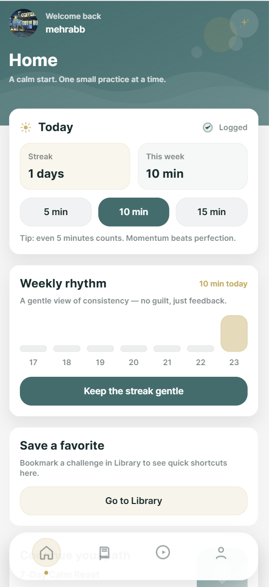
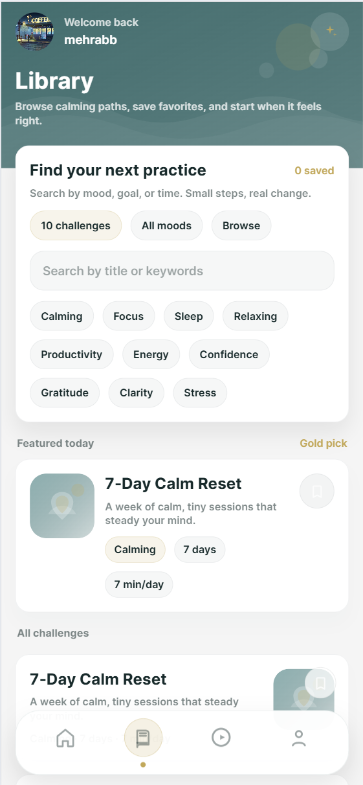
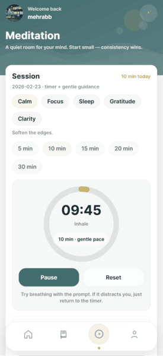
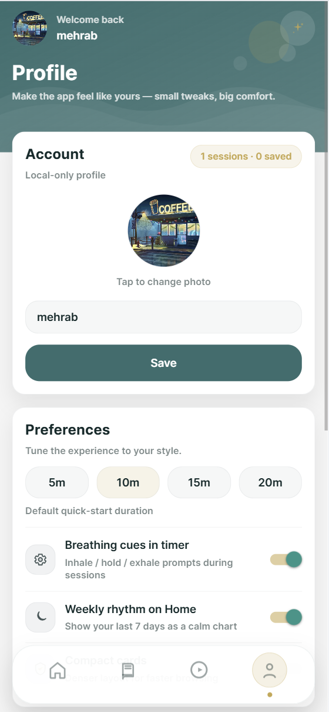
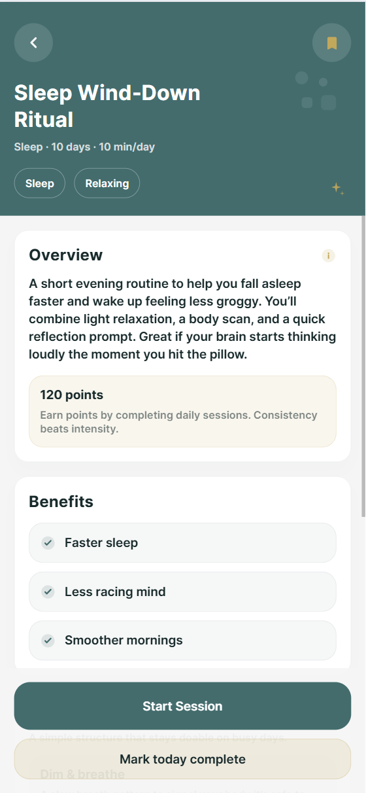

# 🌿 Habitly — A Gentle Meditation & Focus App

Habitly is a calm-first meditation and focus app designed around **consistency, not guilt**.  
It helps users build sustainable mindfulness habits with short, intentional sessions — across web and mobile — using a clean, emotionally-aware UI.

## 🚀 Deployment

### https://habitly-6nkk.vercel.app/
---

## ✨ Features at a Glance

- 🧘 Guided meditation & focus sessions  
- 📚 Curated calming challenges & programs  
- 📈 Gentle streaks & weekly rhythm tracking  
- ⭐ Save favorites for quick access  
- ⚙️ Local-first profile & preferences  
- 🌐 Web-first, mobile-ready architecture (Expo)

---

## 🏠 Home — Your Daily Anchor

The Home screen gives a **clear, calming snapshot** of today:
- Current streak
- Weekly minutes
- One-tap session start
- Gentle encouragement (no shame mechanics)



---

## 📚 Library — Find Your Next Practice

Browse curated challenges by:
- Mood
- Goal
- Duration

Each challenge is designed as a *path*, not a checklist — encouraging repetition and depth.



---

## ⏱ Meditation — Focus Without Friction

A distraction-free meditation experience with:
- Adjustable session length
- Optional breathing cues
- Large, readable timer
- Minimal controls (pause / reset only)

The design intentionally avoids visual noise once the session starts.



---

## 👤 Profile & Preferences — Local-First by Design

Everything is stored **locally**, by choice:
- Profile name & avatar
- Default session length
- UI preferences (breathing cues, compact cards, rhythm charts)

No accounts. No backend. No tracking.



---

## 🌙 Challenge Detail — Context Before Action

Each challenge explains *why* it exists before asking users to start:
- Overview & benefits
- Expected time commitment
- Clear call-to-action



---

## 🧠 Engineering Decisions (The Real Story)

This project intentionally prioritizes **clarity, resilience, and learnability** over shortcuts.

### 1. Why Expo + React Native Web

**Decision**
- Single codebase for web-first delivery
- Expo for fast iteration and native parity
- React Native Web to avoid duplicating UI logic

**Tradeoff**
- Web storage limits (AsyncStorage quota)
- Style warnings (`shadow*`, `pointerEvents`) on web

**Outcome**
- One UI system, predictable behavior across platforms
- Issues surfaced early instead of post-launch

---

### 2. Local-Only Storage (On Purpose)

**Decision**
- No backend
- No authentication
- No remote state

All user data lives in `AsyncStorage`.

**Challenges**
- Browser quota exceeded when storing images as base64
- Async race conditions during profile updates
- Reset logic needing to be atomic and safe

**Fixes**
- Stored image URIs instead of raw image blobs
- Centralized storage access via a single `store.ts`
- Explicit reset flow with confirmation modal

---

### 3. Navigation & Layout Bugs (and Lessons)

**What went wrong**
- Bottom tab bar overlapping content
- Inconsistent padding across screens
- Custom tab bar component causing `undefined` render errors
- Double headers due to mixed navigator configs

**How it was fixed**
- Standardized `contentContainerStyle` padding across screens
- Introduced a single source of truth for bottom spacing
- Carefully aligned tab bar height with scroll padding
- Refactored custom TabBar exports (named vs default mismatch)

**Lesson**
> Navigation bugs aren’t visual problems — they’re architectural ones.

---

### 4. Styling for Calm, Not Cleverness

**Decision**
- Soft shadows, rounded cards, low-contrast accents
- Minimal animation
- No aggressive gradients or dopamine loops

**Technical note**
- Replaced deprecated `shadow*` styles with `boxShadow` for web
- Accepted non-critical dev warnings to preserve design intent

---

## 🐛 What Broke Along the Way

This project went through **real failure states**, including:

- ❌ Blank screen due to bundler OOM errors  
- ❌ MIME type errors caused by failed web transforms  
- ❌ Duplicate function declarations (`setProfile`)  
- ❌ Unicode escape issues in copied code  
- ❌ AsyncStorage quota crashes  
- ❌ Invalid JSX elements from mis-exported components  

Each one was debugged systematically:
- Reading stack traces *fully*
- Fixing root causes, not silencing errors
- Restarting the mental model when needed

**Steps:**
```bash
npm install

npx expo export:web

also guys check out my website [](https://mehrabdev.com)
